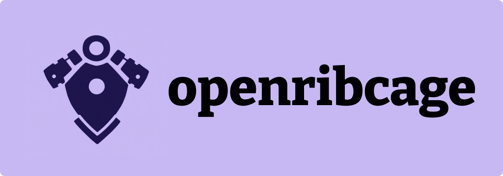

# openribcage

[](https://opensource.org/licenses/Apache-2.0)
[](https://goreportcard.com/report/github.com/craineboss/openribcage)
[](https://discord.gg/craine-io)

> **The Universal Bridge for AI Agent Frameworks**

openribcage is the framework-agnostic abstraction layer that enables natural coordination of AI agencies across heterogeneous frameworks. Instead of learning different technical languages for each agent framework, coordinate all your agents through a single, transparent interface.

## 🎯 The Problem We're Solving

Enterprise teams are adopting multiple AI agent frameworks—kagent for infrastructure, CrewAI for business processes, n8n for workflows, LangGraph for complex decision trees. Each framework speaks a different language, requires different skills, and creates operational silos.

**What if there was a universal translator?**

## 🔍 What openribcage Does

openribcage sits between your avatar interface (AAMI) and your heterogeneous agent frameworks, providing:

- **🔗 Framework-Agnostic Coordination**: Unified API layer for any agent framework
- **🛡️ Enterprise Security**: Built-in security patterns with Agent Gateway integration  
- **👥 Natural Team Dynamics**: Coordinate agents like human colleagues
- **📊 Complete Transparency**: Always see what's happening in your agent ecosystem
- **🔌 Simple Integration**: Standardized adapter pattern for connecting frameworks

## 🏗️ Architecture

```
┌─────────────────────────────────────────────────────────────────┐
│                 AAMI - Avatar Agency Management Interface       │
│          (Avatar-based Human-Agent Coordination)                │
├─────────────────────────────────────────────────────────────────┤
│              openribcage - Universal Agency Engine              │
│           (Framework-agnostic abstraction layer)                │
├─────────────────────────────────────────────────────────────────┤
│              AI Agent Framework Layer                           │
│           (kagent, AutoGen, CrewAI, LangGraph, etc.)           │
├─────────────────────────────────────────────────────────────────┤
│           Model Context Protocol (MCP) Layer                    │
│                  (Standardized Tool Access)                     │
├─────────────────────────────────────────────────────────────────┤
│              External Tools & Systems                           │
│    (Kubernetes, Prometheus, GitHub, JIRA, Slack, Datadog)       │
└─────────────────────────────────────────────────────────────────┘
```

openribcage provides the critical coordination layer that makes AAMI's natural avatar interface possible while maintaining complete transparency into your agent ecosystem.

## 🎪 Core Concepts

### Framework Adapters
Plugin-style connectors that translate between openribcage's standard interface and each framework's specific API patterns. Each adapter handles:
- Agency lifecycle management (create, start, stop, delete)
- Real-time status monitoring and reporting
- Command translation and execution
- Framework-specific configuration management

### Agency Abstraction
A unified representation of AI agencies regardless of underlying framework:
- **Capabilities**: What the agency can do
- **Status**: Current operational state
- **Metadata**: Framework, specialization, performance metrics
- **Communication**: Standardized interaction patterns

### Real-time Coordination
Continuous synchronization between AAMI and framework agencies:
- Live status updates and activity streaming
- Dynamic capability registration and discovery
- Cross-framework agency collaboration
- Performance monitoring and optimization

## 🛠️ Supported Frameworks

### Current Development Priority
1. **kagent** - Kubernetes-native agent framework (reference implementation)
2. **n8n** - Visual workflow automation
3. **CrewAI** - Role-based agent team coordination
4. **LangGraph** - Workflow-based agent orchestration

### Framework Adapter Architecture
Each framework gets its own adapter that implements the openribcage interface:
```go
type FrameworkAdapter interface {
    // Agency lifecycle management
    CreateAgency(config AgencyConfig) (*Agency, error)
    DeleteAgency(id string) error
    
    // Real-time monitoring
    GetAgencyStatus(id string) (*AgencyStatus, error)
    StreamAgencyActivity(id string) (<-chan AgencyActivity, error)
    
    // Command execution
    ExecuteCommand(agencyID string, command Command) (*Result, error)
}
```

## 🚀 Getting Started

> **Note**: openribcage is currently in active development. We're in the foundation phase, building the core architecture and kagent reference implementation.

### Prerequisites
- **Kubernetes cluster** (k3d recommended for development)
- **Go 1.21+** for core development
- **Docker** for containerization

### Development Setup
```bash
# Clone the repository
git clone https://github.com/craineboss/openribcage.git
cd openribcage

# More setup instructions coming as we develop the core system
```

## 🤝 Contributing

We're actively seeking contributors, especially:
- **Framework adapter developers** who want to connect their favorite frameworks
- **Enterprise developers** dealing with multi-framework complexity  
- **Security experts** passionate about transparent, auditable AI systems
- **Go developers** excited about distributed systems and Kubernetes

See [CONTRIBUTING.md](CONTRIBUTING.md) for detailed guidelines.

## 🗺️ Development Roadmap

### Phase 1: Foundation & Research (Weeks 1-2) 🔄 *Current Phase*
- ✅ Framework-agnostic architecture design
- ✅ Community building strategy
- 🔄 kagent adapter specification
- 🔄 AAMI integration planning

### Phase 2: Core Infrastructure (Weeks 3-5)
- Core openribcage engine implementation
- kagent reference adapter
- Basic AAMI integration layer
- Kubernetes packaging

### Phase 3: Multi-Framework Support (Weeks 6-8)
- n8n framework adapter
- CrewAI framework adapter  
- LangGraph framework adapter
- Cross-framework coordination testing

### Phase 4: Production Readiness (Weeks 9-12)
- Management dashboard
- Security hardening
- Performance optimization
- Comprehensive testing

## 🔒 Security & Enterprise Features

openribcage integrates with [Agent Gateway](https://agentgateway.dev/) for enterprise-grade security:
- **Credential inheritance and access control**
- **Cross-framework authentication**
- **Comprehensive audit logging**
- **Compliance framework support**

## 🌟 Why Framework-Agnostic?

- **Avoid Vendor Lock-in**: Choose frameworks based on capability, not limitation
- **Mix and Match**: Use kagent for infrastructure + CrewAI for business processes
- **Future-Proof**: Add new frameworks without rebuilding coordination logic
- **Transparency**: Always understand what's happening across your entire agent ecosystem

## 📖 Documentation

- **[Architecture Guide](docs/architecture.md)** - Deep dive into openribcage design (coming soon)
- **[Security Patterns](docs/security.md)** - Agent Gateway integration (coming soon)
- **[Framework Adapters](docs/adapters/)** - Building framework connectors (coming soon)
- **[API Reference](docs/api.md)** - Complete API documentation (coming soon)

## 🎯 Community & Support

- **💬 Discord**: [Join our community](https://discord.gg/craine-io)
- **🐛 Issues**: [Report bugs or request features](https://github.com/craineboss/openribcage/issues)
- **📧 Email**: [contact@craine.io](mailto:contact@craine.io)
- **📚 Documentation**: [docs.craine.io](https://docs.craine.io) (coming soon)

## 🔮 The Vision

A world where coordinating AI agents feels as natural as managing human teams, where framework choice enhances rather than constrains your capabilities, and where transparency builds trust in autonomous systems.

When your infrastructure agents (kagent) can seamlessly collaborate with your business process agents (CrewAI) and your workflow agents (n8n), all coordinated through natural conversation with avatar interfaces—that's the future openribcage enables.

## 📄 License

This project is licensed under the Apache License 2.0 - see the [LICENSE](LICENSE) file for details.

## 🙏 Acknowledgments

- [Solo.io](https://solo.io) for kagent framework collaboration
- [Agent Gateway](https://agentgateway.dev/) for security pattern inspiration
- The broader open source AI agent framework community

---

**Ready to crack open the ribcage and see how AI agents really work?** Join us in building the universal coordination layer for the agent ecosystem.

**[Get Involved →](CONTRIBUTING.md)** | **[Join Discord →](https://discord.gg/craine-io)** | **[Read Strategy →](https://github.com/craine-io/project-openribcage/blob/main/strategy/community-building-strategy.md)**
